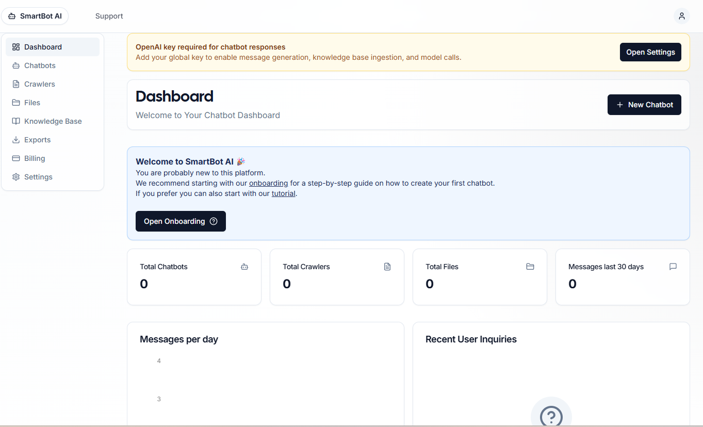
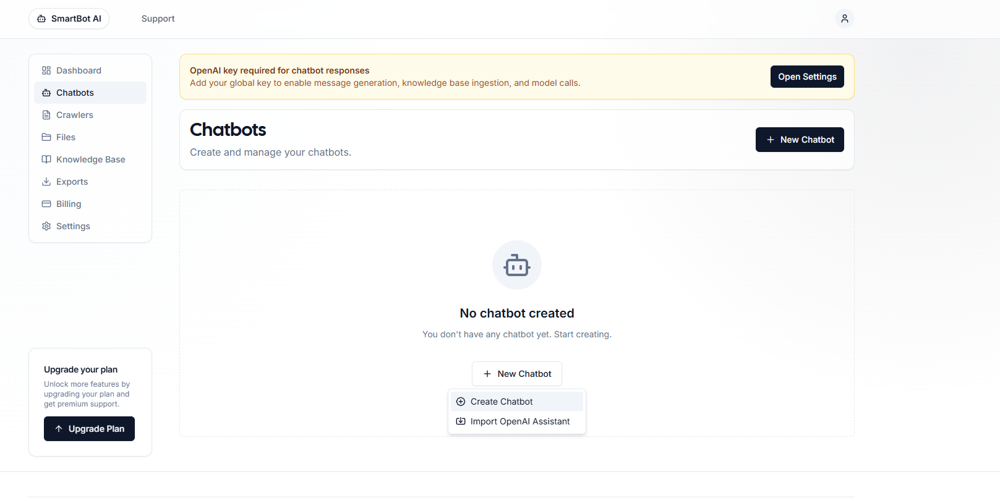
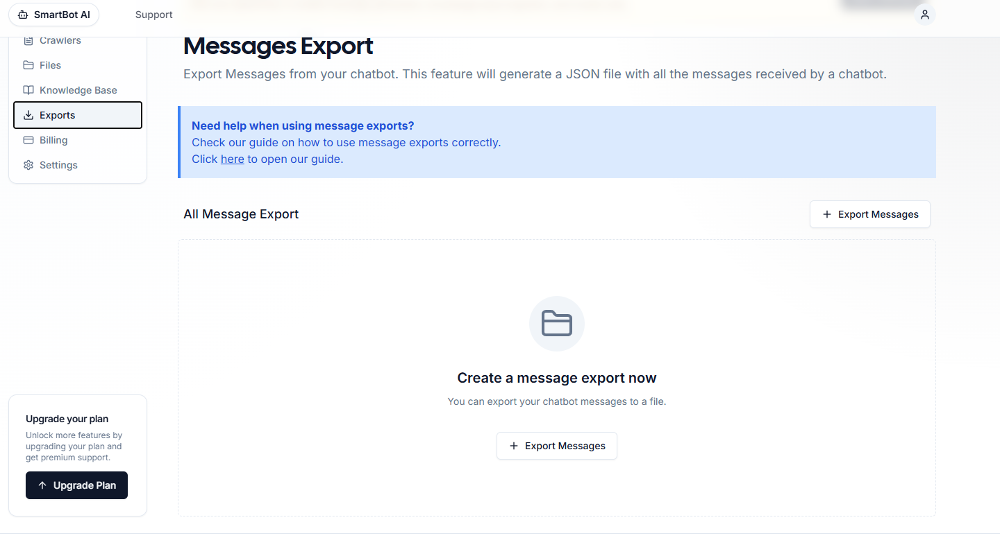
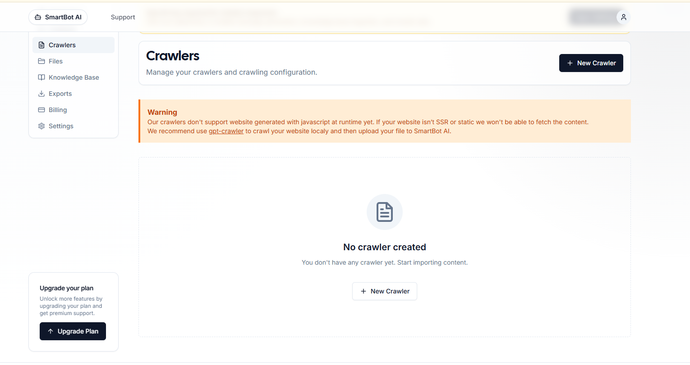
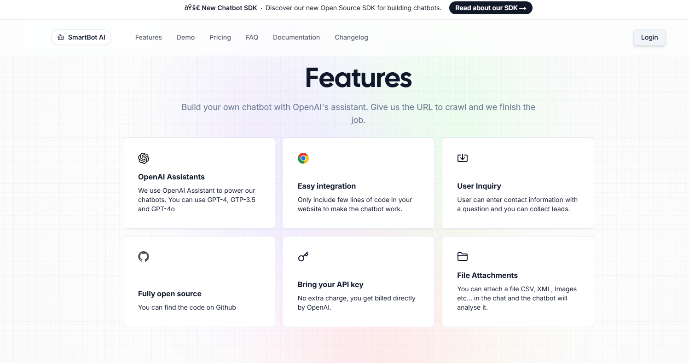
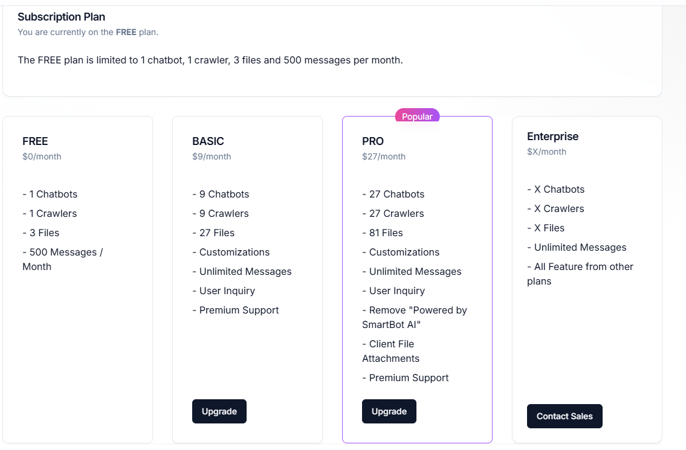
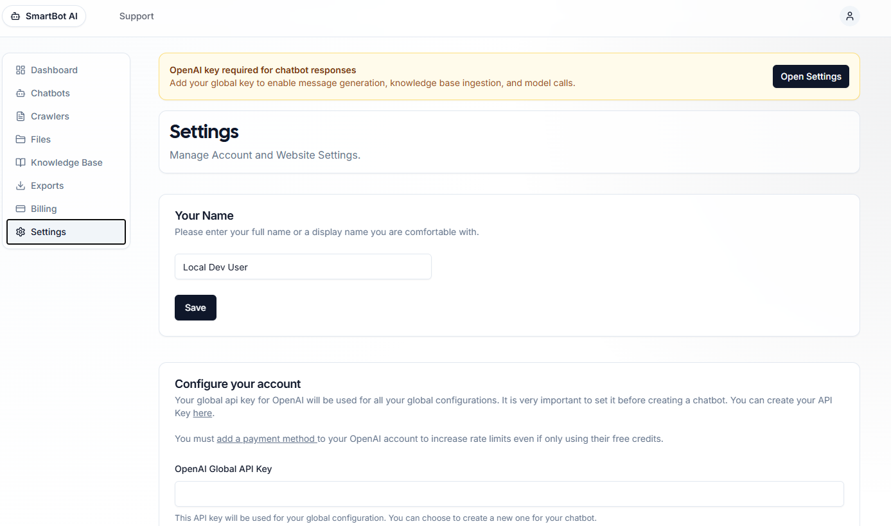

# SmartBot AI

SmartBot AI is a SaaS platform for building production-ready AI chatbots
that your customers can embed on any website. It ships with multi-user
accounts, a dashboard, an OpenAI-powered chat engine, an embeddable
widget, and — new in this release — a **Knowledge Base + RAG
(Retrieval-Augmented Generation)** pipeline so each chatbot can answer
from your own business data.

## Highlights

- OpenAI Assistant / Chat API integration
- Multi-tenant SaaS dashboard with Stripe subscriptions
- Embeddable chatbot widget (per-user `botId`)
- **Knowledge Base**: upload PDFs or paste raw text/FAQs
- **RAG pipeline**: chunking, OpenAI embeddings, cosine similarity
  retrieval, and context injection into each chat completion
- Clean, modular `lib/rag/*` utilities you can reuse

## Quick start

```bash
# 1. Install dependencies
npm install

# 2. Copy env template and fill in values
cp .env.example .env

# 3. Generate Prisma client and apply schema
npx prisma generate
npx prisma db push

# 4. Run the dev server
npm run dev
```

The dashboard is served at `http://localhost:3000/dashboard`.

## Screenshots

### Landing & Dashboard




### Core Features







### Billing & Settings




## Knowledge Base & RAG

Once signed in, open **Dashboard → Knowledge Base** to:

1. Upload a PDF — text is extracted with `pdf-parse`, split into
   500–1000 character chunks, each chunk is embedded via OpenAI, and
   chunks + embeddings are persisted to Postgres.
2. Paste raw text / FAQs — processed through the same chunk →
   embed → store pipeline.
3. Review or delete previously ingested documents.

At chat time the user's message is embedded, the **top-k** most relevant
chunks are retrieved via cosine similarity, and they are injected into
the system prompt before the request is sent to OpenAI.

## Embed script (per-user)

Every user gets a unique embed snippet tied to their chatbot:

```html
<script src="https://your-app.com/chatbot.js?botId=USER_CHATBOT_ID"></script>
```

The widget is lightweight, data is scoped per-chatbot, and API calls
are authenticated so users cannot query each other's knowledge bases.

## API

| Method | Path                           | Description                        |
|--------|--------------------------------|------------------------------------|
| POST   | `/api/knowledge-base/upload-pdf` | Upload a PDF and ingest its text  |
| POST   | `/api/knowledge-base/add-text`   | Ingest raw text / FAQs            |
| GET    | `/api/knowledge-base`            | List the current user's documents |
| DELETE | `/api/knowledge-base/:id`        | Remove a document + its chunks    |
| GET    | `/chatbot.js?botId=...`          | Serve the embed widget for a bot  |

## Tech stack

Next.js 14 App Router · TypeScript · Prisma + PostgreSQL · Tailwind &
shadcn/ui · OpenAI SDK · Vercel Blob for uploads · Stripe for billing.

## License

See [LICENSE](./LICENSE).
